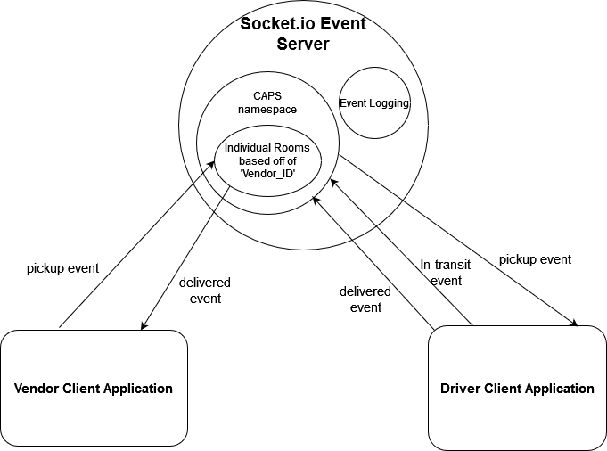

# CAPS: The Code Academy Parcel Service

## Installation

  clone repo, and then in a terminal run the 'npm i' command while in the root directory to install dependencies.

  Run the socket.io server, and the driver client. Next run the  then navigate to a browser or an API testing tool. At the /caps route supply as a query string a name of a store do kick of the sequence of events
  
## Summary of Problem Domain

  Create a basic event driven application. This app should simulate a delivery service where vendors ship products using the delivery service and when drivers deliver them, those venders will be notified that their customers received what they purchased.
  
  Phase 1 requirements:

    Setup a system of events and handlers that allows for the following:

    Vendors will be alerted by the system when a package is picked up.

    Drivers, will be notified when there is a package to be delivered.

    Drivers will alert the system when they have picked up a package and it is in transit.

    The system will be alerted when a package has been delivered.

    A vendor will be notified when their package has been delivered.

    App will have Proper CI/CD configuration

  Phase 2 requirements:

    Add a socket server with a CAPS namespace that will replace the event driver logic coded with the Node events module in the previous phase and handle all event driven logic.

    Have the Vendor and Driver clients interact with this namespace to perform the same actions as in Phase 1.

## Links to application deployment

  <!-- App deployed on Heroku [here]() -->

  Pull req from dev found [here](https://github.com/Beers15/CAPS/pull/2)

## Uml Diagram

