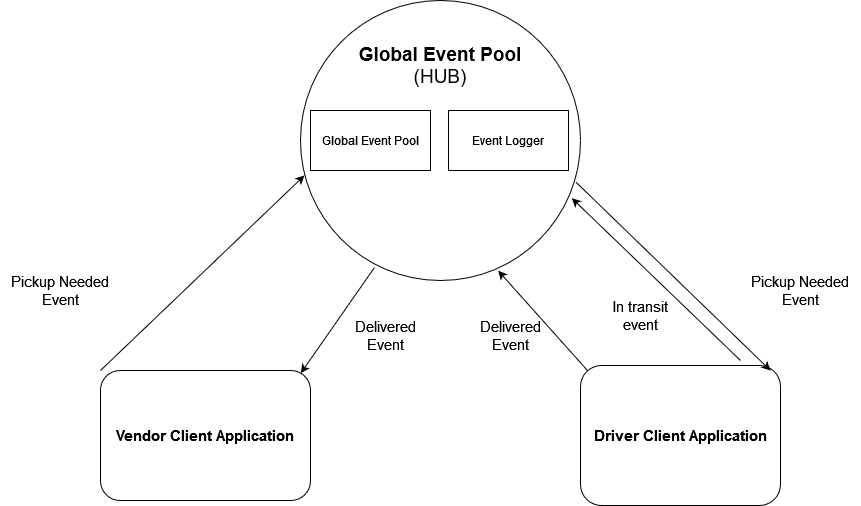

# CAPS: The Code Academy Parcel Service

## Installation

  clone repo, and then in a terminal run the 'npm i' command while in the root directory to install dependencies.
  
  To run the application, enter the 'npm run start' command in a terminal while in the root directory. Phase 1 will just output the sequence of events from sample data.

## Summary of Problem Domain

  Create a basic event driven application. This app should simulate a delivery service where vendors ship products using the delivery service and when drivers deliver them, those venders will be notified that their customers received what they purchased.
  
  Phase 1 requirements:

    Setup a system of events and handlers that allows for the following:

    Vendors will be alerted by the system when a package is picked up.

    Drivers, will be notified when there is a package to be delivered.

    Drivers will alert the system when they have picked up a package and it is in transit.

    The system will be alerted when a package has been delivered.

    A vendor will be notified when their package has been delivered.

    App will have Proper CI/CD configuration

## Links to application deployment

  <!-- App deployed on Heroku [here]() -->

  Pull req from dev found [here]()

## Uml Diagram

